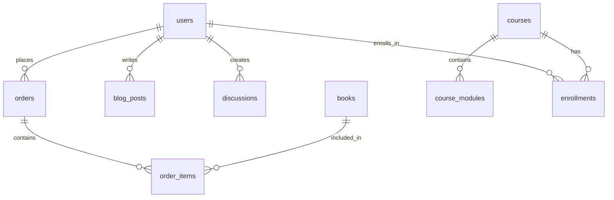

# Victoria Chisom Platform - Backend Implementation with Drizzle ORM

## Overview
This document outlines the complete backend implementation using **Drizzle ORM** instead of Prisma, following the 4-week development plan.

## Technology Stack
- **Database**: Neon PostgreSQL
- **ORM**: Drizzle ORM + Drizzle Kit
- **Authentication**: NextAuth.js
- **Payments**: Paystack & Flutterwave
- **Email**: Resend
- **Storage**: ImageKit
- **Framework**: Next.js 15 with App Router

## Initial Setup

### 1. Install Dependencies
```bash
npm install drizzle-orm drizzle-kit @neondatabase/serverless postgres
npm install next-auth bcryptjs jose resend imagekit
npm install --save-dev @types/bcryptjs
```

### 2. Environment Configuration
Copy `.env.example` to `.env.local` and fill in your credentials:
```bash
cp .env.example .env.local
```

### 3. Database Setup
```bash
# Generate initial migration
npm run db:generate

# Push schema to database
npm run db:push

# Open Drizzle Studio (database browser)
npm run db:studio
```

## Drizzle ORM Benefits Over Prisma

### ✅ **Advantages of Drizzle**
1. **Type Safety**: Better TypeScript integration
2. **Performance**: Smaller bundle size and faster queries
3. **SQL-like**: More familiar syntax for SQL developers
4. **Flexibility**: Direct SQL access when needed
5. **Tree-shaking**: Only includes used parts in bundle
6. **No Code Generation**: Schema is written in TypeScript
7. **Better Relations**: More intuitive relationship definitions

### 📊 **Comparison**
```typescript
// Drizzle (more explicit and type-safe)
const users = await db.select().from(usersTable).where(eq(usersTable.id, userId))

// Prisma (magic methods)
const users = await prisma.user.findMany({ where: { id: userId } })
```

## Database Schema Structure

### Core Tables
- **users** - User authentication and profiles
- **books** - Book catalog and metadata
- **orders** - Purchase orders and transactions
- **blog_posts** - Blog content management
- **discussions** - Community discussions
- **events** - Community events
- **courses** - Academy courses and modules

### Key Features
- UUID primary keys for better scalability
- Enum types for status fields
- JSONB fields for flexible data storage
- Proper foreign key relationships
- Timestamp tracking for all records

## API Structure

### Authentication Endpoints
```
POST /api/auth/register - User registration
POST /api/auth/login - User login
POST /api/auth/logout - User logout
POST /api/auth/reset-password - Password reset
```

### Book Management
```
GET /api/books - List all published books
POST /api/books - Create new book (admin)
GET /api/books/[id] - Get specific book
PUT /api/books/[id] - Update book (admin)
DELETE /api/books/[id] - Delete book (admin)
```

### Order Processing
```
POST /api/orders - Create new order
GET /api/orders - List user orders
GET /api/orders/[id] - Get order details
POST /api/orders/[id]/cancel - Cancel order
```

### Payment Integration
```
POST /api/payments/paystack/initialize - Initialize Paystack payment
POST /api/payments/paystack/webhook - Handle Paystack webhooks
POST /api/payments/flutterwave/initialize - Initialize Flutterwave payment
POST /api/payments/flutterwave/webhook - Handle Flutterwave webhooks
```

## Development Workflow

### Week 1: Foundation
1. **Database Schema**: Complete Drizzle schema implementation
2. **Authentication**: NextAuth.js setup with Drizzle adapter
3. **Basic APIs**: User management and book CRUD operations

### Week 2: Content Management
1. **Book Management**: Full book catalog system
2. **Blog System**: Content creation and management
3. **File Uploads**: ImageKit integration

### Week 3: E-commerce
1. **Shopping Cart**: Cart management and checkout
2. **Payment Processing**: Paystack and Flutterwave integration
3. **Order Management**: Order lifecycle and tracking

### Week 4: Community & Deployment
1. **Community Features**: Forums, events, discussions
2. **Academy System**: Course management and enrollment
3. **Final Integration**: Connect all frontend components

## Data Relationships



## Migration from Mock Data

### Frontend Updates Required
1. **Remove hardcoded data** from components
2. **Add API calls** using fetch or SWR
3. **Implement loading states** for async operations
4. **Add error handling** for failed requests
5. **Update state management** for real data

### Example Migration
```typescript
// Before (mock data)
const books = [
  { id: 1, title: "Letter to My Sister", price: 7500 }
]

// After (API integration)
const { data: books, error, isLoading } = useSWR('/api/books', fetcher)
```

## Security Considerations

### Authentication
- JWT tokens for session management
- Password hashing with bcrypt
- Email verification required
- Role-based access control

### Data Protection
- Input validation with Zod
- SQL injection prevention (Drizzle's prepared statements)
- XSS protection
- CSRF protection

### Payment Security
- Webhook signature verification
- Secure API key management
- Transaction logging and audit trails

## Performance Optimizations

### Database
- Indexed columns for frequent queries
- Connection pooling with Neon
- Query optimization with Drizzle
- Caching strategies for static data

### API
- Response caching
- Pagination for large datasets
- Image optimization with ImageKit
- CDN integration

## Testing Strategy (Post-4 weeks)

While tests are excluded from the 4-week plan, here's the recommended testing approach:

1. **Unit Tests**: Individual API route testing
2. **Integration Tests**: Database operations
3. **E2E Tests**: Payment flow testing
4. **Load Tests**: Performance under load

## Deployment Checklist

### Environment Variables
- [ ] Production database URL
- [ ] Authentication secrets
- [ ] Payment API keys
- [ ] Email service keys
- [ ] Storage service keys

### Database
- [ ] Production schema migration
- [ ] Backup strategy implementation
- [ ] Connection pooling configuration

### Security
- [ ] HTTPS enforcement
- [ ] Security headers configuration
- [ ] API rate limiting
- [ ] Webhook endpoint security

This implementation provides a robust, scalable backend foundation using modern tools and best practices, specifically optimized for the Victoria Chisom platform requirements.
